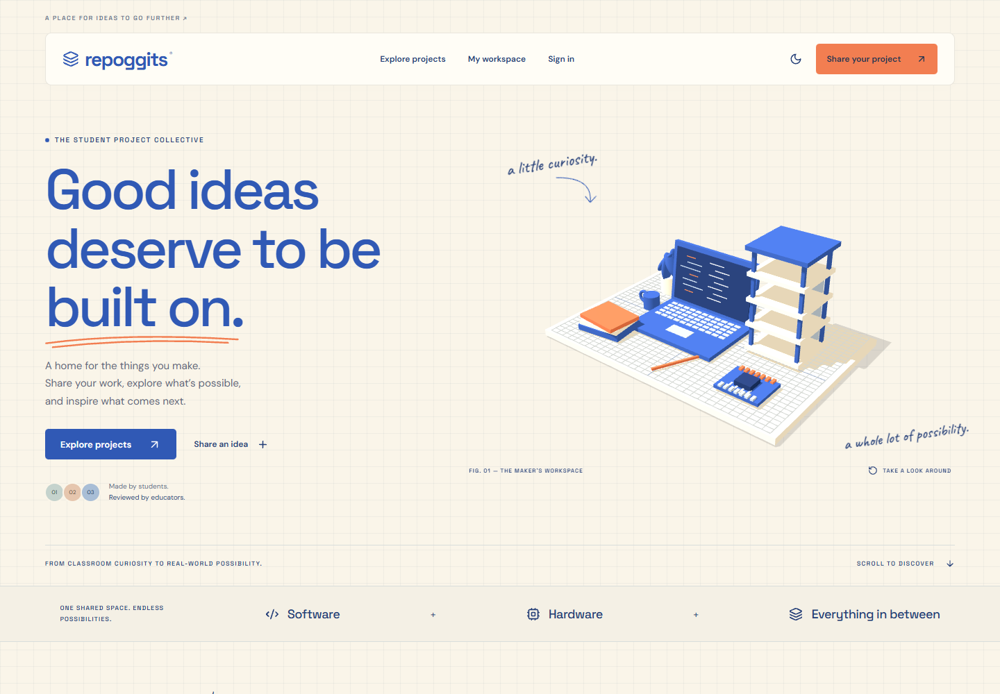
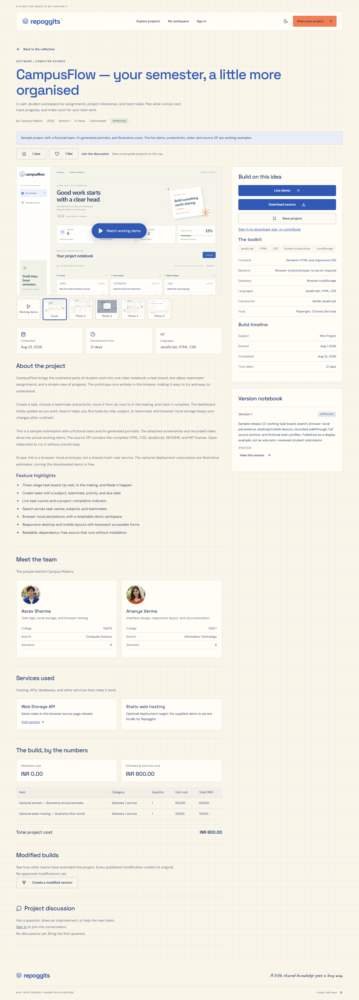
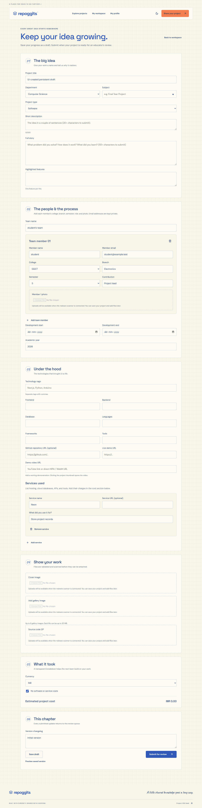
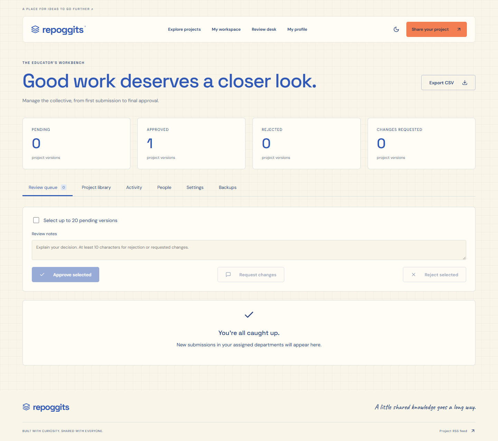
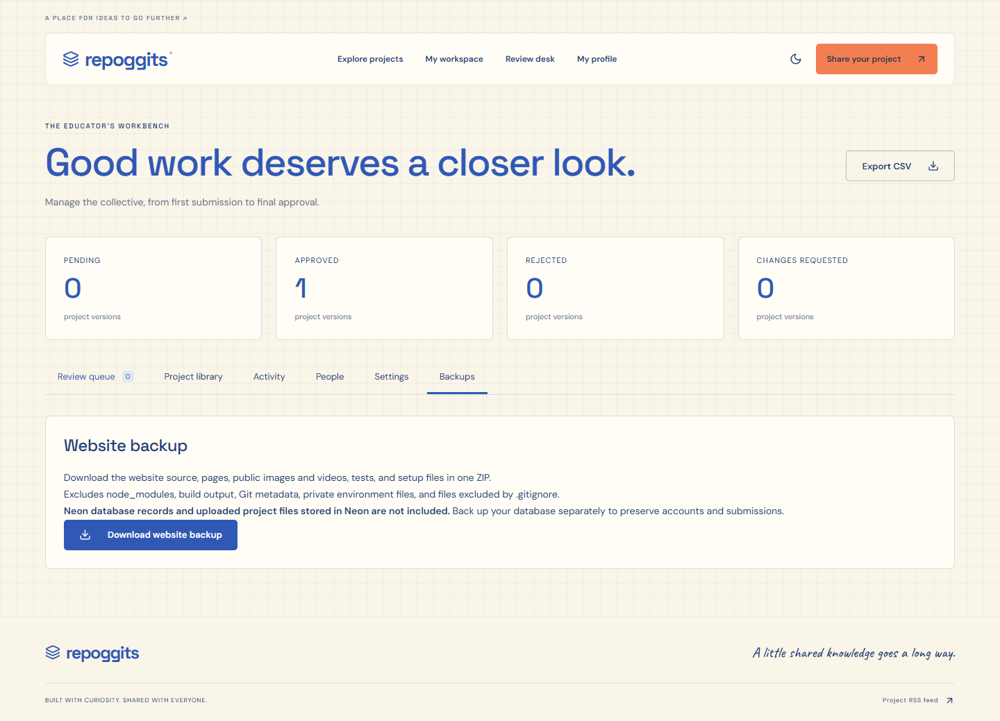
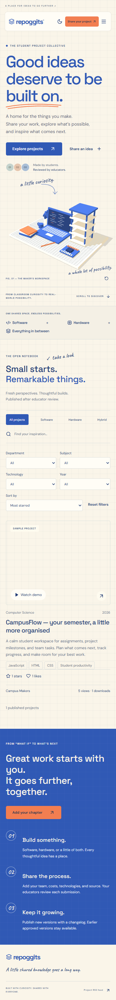
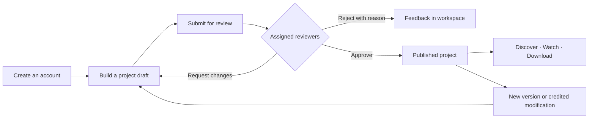

<div align="center">

# repoggits®

### Good ideas deserve to go further.

A home for student projects. Show the build, share the process, and help the next team start stronger.

**Next.js 16 · TypeScript · Neon PostgreSQL · Three.js**

[Visual tour](#a-look-inside) · [How it works](#from-first-idea-to-published-project) · [Quick start](#run-it-locally) · [VPS setup](#host-on-a-vps) · [Testing](#tested-workflows)

</div>



## Built for the work behind the grade

Repoggits brings software, hardware, and hybrid academic projects into one searchable collection. Students publish complete project stories; educators review submissions; other teams can learn from the source and create credited modifications.

The interface combines warm graph paper, cobalt blue, orange accents, bundled fonts, and a Three.js workbench. It adapts to mobile and supports dark mode.

| For students | For educators | For the institution |
| --- | --- | --- |
| Rich project pages with demos and source | Department/subject review assignments | Super Admin user and role management |
| Team photos, college, branch, and semester | Approve, reject, or request changes | Categories, activity logs, and CSV reports |
| Automatic browser recovery and saved drafts | One or two distinct reviewer approvals | Staff picks and project archiving |
| Stars, likes, discussion threads, and remixes | Updated versions return to review | Website source ZIP backups |

## A look inside

### One project. The whole story.

Start with a thumbnail, then explore the working video, gallery, feature highlights, team, technology choices, timeline, and cost breakdown. Source downloads use expiring links. GitHub links are optional.

<details>
<summary><strong>View the complete CampusFlow project page</strong></summary>



</details>

### A submission form that remembers

Work in progress is saved automatically in the same browser, separately for each account and version. Refresh recovery includes completed uploads. **Save draft** also stores a copy in Neon, so you can continue from another device. Leaving during an active upload triggers a browser warning.

<details>
<summary><strong>Explore the project submission form</strong></summary>



*This screenshot uses regression-test fixture data; the current editor also includes automatic recovery status.*

</details>

### An educator’s review desk



The admin panel includes **Review queue**, **Project library**, and **Activity**. Super Admins also get **People**, **Settings**, and **Backups**. Teachers see only work within their assigned review scope.

<details>
<summary><strong>Website backups and mobile preview</strong></summary>





</details>

## Try a complete working example

**CampusFlow** is a browser-based student planner included with the project. Add tasks, assign teammates, move work across the board, search, and reload to see local persistence in action.

```bash
npm run db:sample
```

After starting Repoggits:

- [Open the sample project](http://localhost:3000/projects/e3213918-fb91-4c55-bef3-faf5ca96cec4?play=1)
- [Try the interactive planner](http://localhost:3000/samples/campusflow/index.html)
- [Watch the recorded working demo](public/samples/campusflow/demo.webm)
- [Browse its complete source](examples/campusflow) or download the ZIP from the project page after signing in

The sample includes actual demo screenshots and a recorded walkthrough, full source, fictional team profiles with AI-generated portraits, and illustrative costs. It is labeled as a sample and starts without manufactured votes or reviews. Seeding it again preserves the existing sample.

## From first idea to published project



1. **Build the story.** Add descriptions, feature bullets, images, video URL, source ZIP, team profiles, languages, services, dates, and hardware/software costs.
2. **Save and submit.** Drafts stay private. Submitted versions enter the assigned educators’ queue.
3. **Review with a record.** Decisions are logged. Rejections and change requests require a reason; the approval threshold can be one or two reviewers.
4. **Share the result.** Approved projects enter discovery. The default ranking prioritizes stars, then likes, then recent publication.
5. **Keep improving.** Updates return to moderation while the previous approved version remains available. Modified builds credit their original project and version.

## Run it locally

**Requirements:** Node.js **24+**, npm, and a Neon PostgreSQL database. Google Chrome is needed for the browser tests.

```bash
npm ci
```

Copy `.env.example` to `.env.local` using your editor, then configure:

```dotenv
DATABASE_URL=your_neon_postgresql_connection_string
APP_ORIGIN=http://localhost:3000
EMAIL_VERIFICATION_REQUIRED=false
MAIL_MODE=outbox
```

```bash
npm run db:setup
npm run dev
```

Open **http://localhost:3000**. On Windows PowerShell, use `npm.cmd` if execution policy blocks `npm.ps1`.

### Create the first Super Admin

```bash
npm run db:setup -- administrator@example.edu
```

If no Super Admin exists, this writes a private, single-use invitation to `.local/admin-invitation.txt`. Open the link within 24 hours and choose a password. Existing admins are not replaced by rerunning this command.

Sign in at `/auth`, then open **`/admin`** or click **Review desk**. There are no shipped default credentials. Teacher assignments use values such as `department:Computer Science` or `subject:Mini Project`.

### Email behavior

Email verification is currently optional. In `outbox` mode, messages are stored privately in Neon but **not sent**. To send password-reset and notification emails, configure SMTP using `.env.example` and set `MAIL_MODE=smtp`.

See [the operations guide](docs/OPERATIONS.md#email-delivery) for outbox inspection and delivery commands.

## Host on a VPS

1. Copy the project source and lockfile to the VPS. Install Node.js 24+.
2. Create a private `.env.local` with your Neon connection and deployment settings. Use the same Neon database if you want existing accounts and projects.
3. Set **`APP_ORIGIN` to the exact public browser origin**—scheme, hostname, and port, with no path or trailing slash.
4. Install, initialize, and build:

```bash
npm ci
npm run db:setup
npm run build
npm run start
```

For an HTTPS domain:

```dotenv
APP_ORIGIN=https://projects.your-domain.edu
```

For a temporary direct-IP setup, use `http://YOUR_VPS_IP:3000`. Configure an HTTPS reverse proxy for regular use. Keep the Node process running with your chosen service manager and allow uploads up to the app’s 20 MB limit at the proxy.

**Restart the application after environment changes.** If your service manager also defines environment variables, update those values too.

| Symptom | What to check |
| --- | --- |
| “This request did not come from the application.” | `APP_ORIGIN` must exactly match the browser’s public origin. Restart after changing it. |
| Admin login works locally but not on the VPS | Check the email, password, and that `DATABASE_URL` points to the same Neon database. |
| Password-reset email never arrives | `outbox` mode stores messages without sending them; configure SMTP for delivery. |
| ZIP rejected | Remove binaries/nested archives; use UTF-8 source files and stay within upload/decompression limits. |
| Source backup unavailable | The full source tree must be present; a minimal runtime-only deployment may not contain it. |

## Files, privacy, and backups

**Uploads use built-in validation, without an external scanner service.** Images are decoded and re-encoded; ZIPs are inspected without extracting or executing their contents.

| Check | Limit or behavior |
| --- | --- |
| Upload size | 20 MB per file |
| Images | PNG, JPEG, WebP; at most 25 megapixels; stored as WebP |
| ZIP entries | At most 2,000; at most 20 MB per expanded entry |
| Total expanded ZIP content | At most 100 MB, with compression-ratio, checksum, and timeout checks |
| Rejected content | Unsafe paths, symlinks, duplicates, encrypted/nested archives, unsupported binaries, and detected executable signatures |
| Source downloads | Sign-in required; signed URL expires after five minutes and is bound to the account |

These are structural/content checks, **not a full antivirus engine**. Source code is never executed by the server. Files are stored privately in Neon and served through authorization checks.

**Admin → Backups** downloads website source, public assets, tests, and setup files. It honors `.gitignore` and excludes dependencies, build output, Git metadata, private environment files, and private keys. Restore instructions are included.

**The source ZIP does not include Neon records or files stored in Neon. Back up the database separately to preserve accounts, submissions, and uploaded media.**

## Tested workflows

```bash
npm run typecheck     # TypeScript checks
npm run test:e2e      # Production build + browser/API regression suite
npm run test:dev      # Turbopack styles, fonts, compilation, and hydration
npm test             # Both test suites
```

Regression coverage includes authentication, access control, review scopes, version moderation, signed downloads, uploads, sample playback, browser draft recovery, account separation, and backup exclusions/downloads.

Tests create isolated `repoggits_test_*` schemas in Neon and remove those schemas afterward. They use ports **3107** and **3108**. **Do not point backend integration tests at a live installation through `PLAYWRIGHT_BASE_URL`.**

## Find your way around

```text
app/                    Next.js pages and API routes
components/platform/    Project, editor, workspace, and admin interfaces
lib/                    Authentication, database, moderation, uploads, backups
public/                 Fonts, visual assets, and the sample demo
examples/campusflow/    Runnable sample project and source archive
scripts/                Database setup, sample seeding, mail tools
tests/                  Browser, API, and validation regression tests
docs/                   Screenshots and operations reference
```

[Operations guide](docs/OPERATIONS.md) · [Environment template](.env.example) · [Sample media provenance](examples/campusflow/assets/README.md)

### Current scope

Google OAuth, automated certificates, department leaderboards, and email digests are not implemented. Discovery currently caps at 500 projects and the administration view at 1,000 versions; larger deployments need pagination. Fonts include their own licenses; the CampusFlow sample has its own MIT license.

---

<div align="center">

**Built with curiosity. Shared with everyone.**

</div>
